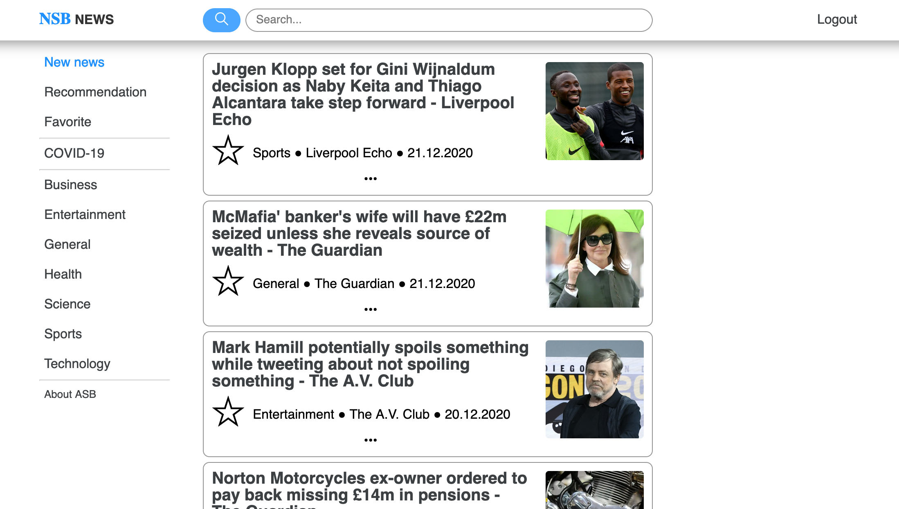

# NSB NEWS

## News Service

***

## Technologies

* Python 3
* SQLite 3
* Apache Spark

Python packages: [Requirements](requirements.txt)

***

## Scripts

Creating a virtual environment:

```!#/zsh
python3 -m venv myvenv
```

Entering the virtual environment:

```!#/zsh
source myvenv/bin/activate
```

or

```!#/zsh
. myvenv/bin/activate
```

Installing all required packages:

```!#/zsh
pip3 install -r requirements.txt
```

Start project:

```!#/zsh
python3 main.py
```

***

## Pages and images

<br/>

### **Login** page (when not logged in)

**URL:** [`http://localhost:5000/login`](http://localhost:5000/login)


<br/>

### **Registration** page (when not logged in)

**URL:** [`http://localhost:5000/register`](http://localhost:5000/register)


<br/>

### **Main** page (when logged in)

**URL:** [`http://localhost:5000`](http://localhost:5000)



<br/>

### **Category** page (when logged in)

**URL pattern:** `http://localhost:5000/c/<string:category_name>`

**URL (Example):** [`http://localhost:5000/c/entertainment`](http://localhost:5000/c/entertainment)


<br/>

### **Search** page (when logged in)

**URL pattern:** `http://localhost:5000/search?q=<string:q>`

**URL (Example):** [`http://localhost:5000/search?q=Gadget`](http://localhost:5000/search?q=Gadget)


<br/>

### **Favorite** page (when logged in)

**URL:** [`http://localhost:5000/favorite`](http://localhost:5000/favorite)


<br/>

### **Recommendation** page (when logged in)

**URL:** [`http://localhost:5000/recommendation`](http://localhost:5000/recommendation)


<br/>

### [ **Admin** ] **Login** page (when not logged in)

**URL:** [`http://localhost:5000/admin/login`](http://localhost:5000/admin/login)


<br/>

### [ **Admin** ] **Dashboard** page (when logged in)

**URL:** [`http://localhost:5000/admin/dashboard`](http://localhost:5000/admin/dashboard)


<br/>

### [ **Admin** ] **Article creation** page (when logged in)

**URL:** [`http://localhost:5000/admin/articles`](http://localhost:5000/admin/articles)


